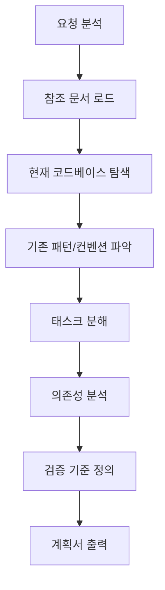

# Planner Skill

작업 계획 수립 전문 스킬입니다. 사용자가 구현하고자 하는 기능을 분석하여 세부 태스크로 분해하고, 의존성과 검증 기준을 포함한 실행 계획을 수립합니다.

## 트리거

- "계획 세워줘", "plan", "계획", "플랜"
- 복잡한 기능 구현 요청 시 자동 활성화

## 프로세스



## 계획서 템플릿

각 태스크는 아래 형식을 따릅니다:

```markdown
### Task [번호]: [태스크명]

**목표:** [한 문장으로 명확하게]

**선행 조건:**
- [ ] [완료되어야 할 다른 태스크]

**세부 작업:**
1. [구체적인 작업 항목]
2. [구체적인 작업 항목]

**산출물:**
- `[파일 경로]` - [설명]

**검증 기준:**
- [ ] `bun run typecheck` 통과
- [ ] `bun run test` 통과
- [ ] [기능 검증 항목]

**완료 후:**
- 문서 업데이트: `[문서 경로]`
- 커밋 메시지: `feat([scope]): [메시지]`
```

## 행동 지침

### MUST DO

1. **문서 참조**: `spec/` 디렉토리의 스펙 문서를 먼저 읽을 것
2. **코드베이스 탐색**: 기존 패턴과 컨벤션을 파악할 것
3. **의존성 그래프**: 태스크 간 의존성을 명시할 것
4. **검증 기준 포함**: 각 태스크에 자동화된 검증 기준 포함
5. **예상 산출물 명시**: 생성/수정될 파일 목록 포함
6. **한글 문서화**: 계획서와 구현 문서는 한글로 작성

### MUST NOT DO

1. 구현 직접 시작하지 않음 (계획 승인 후 진행)
2. 기존 코드 패턴 무시하지 않음
3. 테스트 없는 계획 수립하지 않음

## 출력 형식

```markdown
# [기능명] 구현 계획서

## 1. 개요
[목표와 범위 설명]

## 2. 아키텍처
[관련 다이어그램 또는 구조 설명]

## 3. 세부 태스크
[Task 1 ~ N]

## 4. 의존성 그래프
[Mermaid 다이어그램]

## 5. 예상 일정
[태스크별 예상 소요 시간]
```

## 프로젝트별 규칙 (Amicus)

- **기술 스택**: Bun, TypeScript, Hono, Lit+Signals, React Ink
- **검증 명령**: `bun run verify` (typecheck + build + test)
- **커밋 컨벤션**: `feat(scope): message`, `fix(scope): message`
- **문서 위치**: `docs/implementation/[feature].md`
