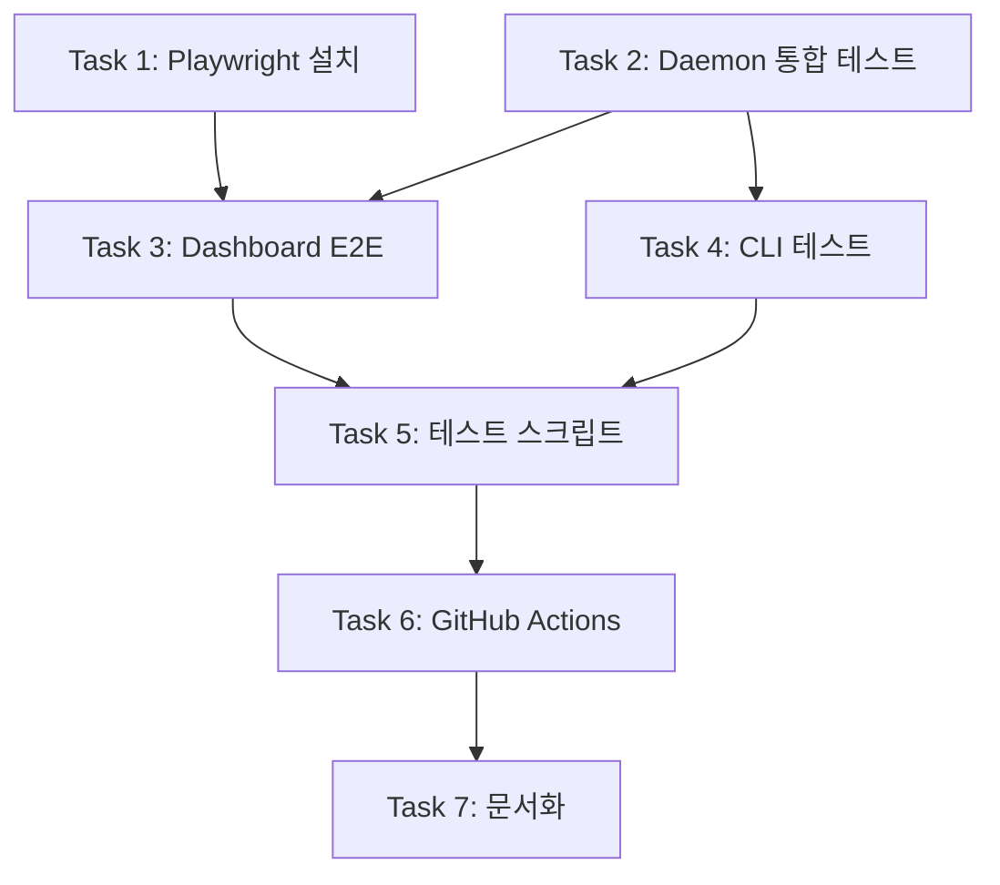

# Interface Layer 테스트 전략 및 구현 계획

## 1. 개요

**목표**: Phase 4에서 구현된 Interface Layer(daemon, dashboard, cli)에 대한 자동화된 검증 테스트 구축

**범위**:
- Daemon API/WebSocket 통합 테스트
- Dashboard E2E 테스트 (Playwright)
- CLI 실행 테스트 (비-TTY 모드)
- GitHub Actions CI 통합

**기술 스택**:
| 컴포넌트 | 테스트 도구 |
|---------|-----------|
| Daemon API | Bun test + fetch API |
| WebSocket | Bun test + WebSocket client |
| Dashboard | Playwright |
| CLI | Bun test + child_process |

---

## 2. 아키텍처

```
┌─────────────────────────────────────────────────────┐
│                  Test Layer                         │
├─────────────────────────────────────────────────────┤
│  E2E Tests        │  Integration Tests │  Unit Tests│
│  (Playwright)     │  (Bun test)        │  (Bun test)│
├─────────────────────────────────────────────────────┤
│  apps/dashboard   │  apps/daemon       │  packages/ │
│  ├── *.e2e.ts     │  ├── *.test.ts     │  (existing)│
├─────────────────────────────────────────────────────┤
│              GitHub Actions CI                      │
│  ├── unit-test job                                  │
│  ├── integration-test job (with daemon)             │
│  └── e2e-test job (with daemon + vite)              │
└─────────────────────────────────────────────────────┘
```

---

## 3. 세부 태스크

### Task 1: Playwright 설치 및 설정

**목표:** Dashboard E2E 테스트를 위한 Playwright 환경 구축

**선행 조건:**
- [x] dashboard 앱 구현 완료

**세부 작업:**
1. Playwright 및 관련 패키지 설치
   ```bash
   cd apps/dashboard
   bun add -d @playwright/test playwright
   ```
2. `playwright.config.ts` 생성
3. `.gitignore`에 `test-results/`, `playwright-report/` 추가

**산출물:**
- `apps/dashboard/playwright.config.ts` - Playwright 설정
- `apps/dashboard/package.json` - 업데이트된 의존성

**검증 기준:**
- [ ] `bun run --cwd apps/dashboard test:e2e --help` 실행 가능
- [ ] Playwright 브라우저 자동 설치 확인

**완료 후:**
- 커밋 메시지: `test(dashboard): setup Playwright for E2E tests`

---

### Task 2: Daemon 통합 테스트 작성

**목표:** Daemon API 및 WebSocket 동작 검증

**선행 조건:**
- [x] daemon 앱 구현 완료

**세부 작업:**
1. `apps/daemon/__tests__/` 디렉토리 생성
2. API 엔드포인트 테스트
   - `api.test.ts`: GET /api/status, /api/tasks, /api/tokenomics
   - HTTP 상태 코드, 응답 구조 검증
3. WebSocket 테스트
   - `websocket.test.ts`: 연결, heartbeat, 이벤트 수신
4. 테스트 유틸리티
   - `test-utils.ts`: 서버 시작/중지 헬퍼

**산출물:**
- `apps/daemon/__tests__/api.test.ts` - API 통합 테스트
- `apps/daemon/__tests__/websocket.test.ts` - WebSocket 테스트
- `apps/daemon/__tests__/test-utils.ts` - 테스트 헬퍼

**검증 기준:**
- [ ] `bun run --cwd apps/daemon test` 통과
- [ ] 모든 API 엔드포인트 테스트 커버리지
- [ ] WebSocket 연결/메시지 테스트 포함

**완료 후:**
- 커밋 메시지: `test(daemon): add integration tests for API and WebSocket`

---

### Task 3: Dashboard E2E 테스트 작성

**목표:** 사용자 시나리오 기반 웹 대시보드 E2E 테스트

**선행 조건:**
- [x] Task 1 완료 (Playwright 설정)
- [x] Task 2 완료 (Daemon 테스트)

**세부 작업:**
1. E2E 테스트 시나리오 작성
   - `dashboard.e2e.ts`: 기본 렌더링 및 컴포넌트 표시
   - `realtime.e2e.ts`: WebSocket 실시간 업데이트
   - `controls.e2e.ts`: 제어 버튼 (pause/resume/cancel)
2. 테스트 픽스처
   - Daemon 서버 자동 시작/중지
   - Mock 데이터 주입

**산출물:**
- `apps/dashboard/tests/dashboard.e2e.ts` - 기본 E2E
- `apps/dashboard/tests/realtime.e2e.ts` - 실시간 테스트
- `apps/dashboard/tests/controls.e2e.ts` - 제어 기능 테스트
- `apps/dashboard/tests/fixtures.ts` - 테스트 픽스처

**검증 기준:**
- [ ] `bun run --cwd apps/dashboard test:e2e` 통과
- [ ] Headless 모드에서 실행 가능
- [ ] 스크린샷/비디오 캡처 설정

**완료 후:**
- 커밋 메시지: `test(dashboard): add E2E tests with Playwright`

---

### Task 4: CLI 실행 테스트 작성

**목표:** 터미널 UI 기본 동작 검증

**선행 조건:**
- [x] cli 앱 구현 완료

**세부 작업:**
1. 비-TTY 모드 테스트
   - `cli.test.ts`: 출력 형식 검증
   - child_process로 CLI 실행
2. 시나리오
   - Daemon 연결 성공 시 출력
   - Daemon 연결 실패 시 에러 메시지
   - 상태 정보 파싱

**산출물:**
- `apps/cli/__tests__/cli.test.ts` - CLI 실행 테스트
- `apps/cli/__tests__/test-utils.ts` - 헬퍼

**검증 기준:**
- [ ] `bun run --cwd apps/cli test` 통과
- [ ] 비-TTY 모드 출력 검증
- [ ] Exit code 검증

**완료 후:**
- 커밋 메시지: `test(cli): add execution tests for terminal UI`

---

### Task 5: 루트 레벨 테스트 스크립트 추가

**목표:** 모든 interface 테스트를 한 번에 실행

**선행 조건:**
- [x] Task 2, 3, 4 완료 (모든 테스트 작성)

**세부 작업:**
1. `package.json`에 스크립트 추가
   ```json
   {
     "test:interface": "bun test apps/*/__tests__/**/*.test.ts",
     "test:e2e": "cd apps/dashboard && bun run test:e2e",
     "test:all": "bun run test && bun run test:interface && bun run test:e2e"
   }
   ```
2. `bun run verify` 명령어 업데이트 (선택적으로 E2E 포함)

**산출물:**
- `package.json` - 업데이트된 스크립트

**검증 기준:**
- [ ] `bun run test:interface` 실행 확인
- [ ] `bun run test:e2e` 실행 확인
- [ ] `bun run test:all` 전체 테스트 실행

**완료 후:**
- 커밋 메시지: `test: add interface test scripts to root package.json`

---

### Task 6: GitHub Actions 워크플로우 업데이트

**목표:** CI에서 interface unit 테스트 및 빌드 자동 검증

**선행 조건:**
- [x] Task 5 완료 (테스트 스크립트)

**세부 작업:**
1. `.github/workflows/ci.yml` 업데이트
   - `test-interface` step 추가 (daemon, cli unit tests)
   - **E2E 테스트는 로컬 전용** (CI에서 제외)
2. Interface 앱 빌드 검증
   - `apps/daemon` 빌드 확인
   - `apps/dashboard` 빌드 확인
   - `apps/cli` 빌드 확인

**산출물:**
- `.github/workflows/ci.yml` - 업데이트된 CI

**검증 기준:**
- [ ] PR 생성 시 CI 통과 확인
- [ ] Interface unit 테스트 실행 확인
- [ ] 각 앱 빌드 성공 확인

**완료 후:**
- 커밋 메시지: `ci: add interface unit tests and build validation`

---

### Task 7: 테스트 문서 작성

**목표:** 테스트 실행 방법 및 가이드 문서화

**선행 조건:**
- [x] Task 6 완료 (모든 테스트 구현 및 CI 설정)

**세부 작업:**
1. `docs/testing/interface-testing-guide.md` 작성
   - 로컬 테스트 실행 방법
   - 테스트 작성 가이드
   - 트러블슈팅
2. README.md 업데이트
   - 테스트 명령어 섹션 추가

**산출물:**
- `docs/testing/interface-testing-guide.md` - 테스트 가이드
- `README.md` - 업데이트

**검증 기준:**
- [ ] 문서 검토 완료
- [ ] 예시 코드 실행 가능

**완료 후:**
- 커밋 메시지: `docs: add interface testing guide`

---

## 4. 의존성 그래프



---

## 5. 예상 일정

| Task | 예상 소요 시간 |
|------|---------------|
| Task 1: Playwright 설치 | 30분 |
| Task 2: Daemon 통합 테스트 | 1.5시간 |
| Task 3: Dashboard E2E | 2시간 |
| Task 4: CLI 테스트 | 1시간 |
| Task 5: 테스트 스크립트 | 20분 |
| Task 6: GitHub Actions | 40분 |
| Task 7: 문서화 | 40분 |
| **총계** | **~6.5시간** |

---

## 6. 예상 파일 구조

```
apps/
├── daemon/
│   └── __tests__/
│       ├── api.test.ts
│       ├── websocket.test.ts
│       └── test-utils.ts
├── dashboard/
│   ├── playwright.config.ts
│   ├── tests/
│   │   ├── dashboard.e2e.ts
│   │   ├── realtime.e2e.ts
│   │   ├── controls.e2e.ts
│   │   └── fixtures.ts
│   └── package.json (updated)
└── cli/
    └── __tests__/
        ├── cli.test.ts
        └── test-utils.ts

.github/workflows/
└── ci.yml (updated)

docs/testing/
└── interface-testing-guide.md

package.json (updated)
README.md (updated)
```

---

## 7. 테스트 커버리지 목표

| 컴포넌트 | 목표 커버리지 |
|---------|--------------|
| Daemon API | 100% 엔드포인트 |
| WebSocket | 주요 이벤트 타입 |
| Dashboard | 핵심 사용자 플로우 |
| CLI | 비-TTY 모드 출력 |

---

## 8. 로컬 vs CI 테스트 전략

| 테스트 유형 | 로컬 | CI |
|------------|------|-----|
| Unit Tests | ✅ | ✅ |
| Integration Tests (daemon, cli) | ✅ | ✅ |
| Dashboard E2E (Playwright) | ✅ | ❌ (로컬 전용) |
| Build Validation | ✅ | ✅ |

**E2E 테스트를 CI에서 제외하는 이유:**
- Playwright 브라우저 설치 및 실행 시간 증가
- 헤드리스 환경에서의 불안정성
- 로컬에서 충분한 검증 가능

---

## 9. 변경 이력

| 날짜 | 버전 | 내용 |
|------|------|------|
| 2025-01-31 | 1.0 | 초안 작성 |
| 2025-01-31 | 1.1 | CI에서 E2E 테스트 제외, 로컬 전용으로 변경 |
