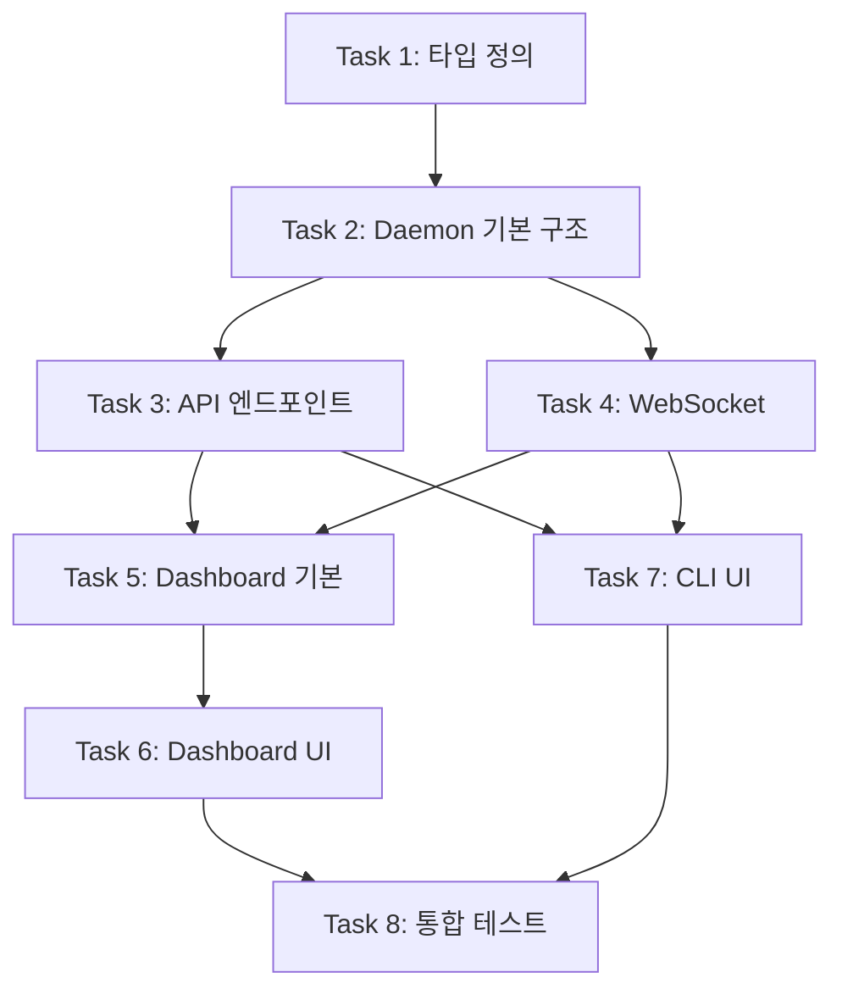

# Phase 4: Interface Layer 구현 계획서

## 1. 개요

**목표**: 사용자가 Amicus 에이전트를 모니터링(Reading)하고 제어(Writing)할 수 있는 인터페이스 구축

**범위**:
- `apps/daemon` - 백그라운드 서버 (API + WebSocket)
- `apps/dashboard` - 웹 기반 실시간 대시보드 (Lit + Signals)
- `apps/cli` - 터미널 UI (React Ink)

**기술 스택**:
| 컴포넌트 | 기술 |
|---------|------|
| 서버 런타임 | Bun |
| HTTP 프레임워크 | Hono |
| 실시간 통신 | WebSocket |
| 웹 UI | Lit + Signals |
| CLI UI | React Ink |

---

## 2. 아키텍처

```
┌─────────────────────────────────────────────────────────────┐
│                     Interface Layer                          │
├─────────────────────────────────────────────────────────────┤
│  apps/dashboard (Web)     │     apps/cli (Terminal)         │
│  ├── Lit + Signals        │     ├── React Ink               │
│  ├── WebSocket Client     │     ├── WebSocket Client        │
│  └── REST API Client      │     └── REST API Client         │
├─────────────────────────────────────────────────────────────┤
│                     apps/daemon (Server)                     │
│  ├── Hono HTTP Server (REST API)                            │
│  ├── WebSocket Server (실시간 이벤트)                        │
│  ├── RoutineEngine 인스턴스                                  │
│  └── 시스템 모니터링                                         │
├─────────────────────────────────────────────────────────────┤
│                     packages/ (Core)                         │
│  core, memory, mcp-client, types                            │
└─────────────────────────────────────────────────────────────┘
```

---

## 3. 세부 태스크

### Task 1: UI 타입 정의 추가

**목표:** Dashboard/CLI에서 사용할 공통 타입을 `packages/types`에 정의

**선행 조건:**
- [x] packages/types 패키지 존재

**세부 작업:**
1. `packages/types/src/dashboard.ts` 생성
2. SystemHealth, TokenUsage, AgentStatus 타입 정의
3. WebSocket 메시지 타입 정의
4. index.ts에 export 추가

**산출물:**
- `packages/types/src/dashboard.ts` - 대시보드용 타입 정의

**검증 기준:**
- [ ] `bun run typecheck` 통과
- [ ] 다른 패키지에서 import 가능

**완료 후:**
- 커밋 메시지: `feat(types): add dashboard types for UI layer`

---

### Task 2: Daemon 서버 기본 구조

**목표:** Hono 기반 HTTP/WebSocket 서버 설정

**선행 조건:**
- [x] Task 1 완료 (타입 정의)

**세부 작업:**
1. `apps/daemon/package.json` 생성 (hono, @hono/node-ws 의존성)
2. `apps/daemon/src/index.ts` - 메인 엔트리포인트
3. `apps/daemon/src/server.ts` - Hono 서버 설정
4. `apps/daemon/src/routes/` - API 라우트
5. `apps/daemon/src/ws/` - WebSocket 핸들러

**산출물:**
- `apps/daemon/` - 전체 서버 구조

**검증 기준:**
- [ ] `bun run --cwd apps/daemon dev` 실행 가능
- [ ] `curl localhost:3000/health` 응답 확인
- [ ] WebSocket 연결 테스트

**완료 후:**
- 커밋 메시지: `feat(daemon): add Hono server with WebSocket support`

---

### Task 3: Daemon API 엔드포인트 구현

**목표:** 대시보드/CLI가 사용할 REST API 구현

**선행 조건:**
- [x] Task 2 완료 (서버 기본 구조)

**세부 작업:**
1. `GET /api/status` - 시스템 상태
2. `GET /api/tasks` - 태스크 목록
3. `POST /api/tasks/:id/pause` - 태스크 일시정지
4. `POST /api/tasks/:id/resume` - 태스크 재개
5. `POST /api/tasks/:id/cancel` - 태스크 취소
6. `GET /api/tokenomics` - 토큰 사용량

**산출물:**
- `apps/daemon/src/routes/api.ts` - API 라우트
- `apps/daemon/src/services/` - 비즈니스 로직

**검증 기준:**
- [ ] 각 엔드포인트 curl 테스트 통과
- [ ] 에러 핸들링 동작 확인

**완료 후:**
- 커밋 메시지: `feat(daemon): implement REST API endpoints`

---

### Task 4: WebSocket 실시간 이벤트

**목표:** 실시간 상태 업데이트를 위한 WebSocket 구현

**선행 조건:**
- [x] Task 2 완료 (서버 기본 구조)

**세부 작업:**
1. WebSocket 연결 관리자
2. RoutineEngine 이벤트 → WebSocket 브로드캐스트
3. 메시지 타입: `task:started`, `task:completed`, `task:failed`, `thought:new`
4. 클라이언트 구독/해제 로직

**산출물:**
- `apps/daemon/src/ws/WebSocketManager.ts`
- `apps/daemon/src/ws/events.ts`

**검증 기준:**
- [ ] WebSocket 연결/해제 정상 동작
- [ ] 이벤트 브로드캐스트 확인
- [ ] 다중 클라이언트 테스트

**완료 후:**
- 커밋 메시지: `feat(daemon): add WebSocket real-time events`

---

### Task 5: Dashboard 기본 구조 (Lit + Signals)

**목표:** Lit 기반 웹 대시보드 프로젝트 설정

**선행 조건:**
- [x] Task 3, 4 완료 (API + WebSocket)

**세부 작업:**
1. `apps/dashboard/package.json` 생성 (lit, @preact/signals-core)
2. Vite 설정 (개발 서버)
3. 기본 레이아웃 컴포넌트
4. API/WebSocket 클라이언트 유틸리티

**산출물:**
- `apps/dashboard/` - 대시보드 프로젝트 구조
- `apps/dashboard/src/components/` - UI 컴포넌트

**검증 기준:**
- [ ] `bun run --cwd apps/dashboard dev` 실행 가능
- [ ] 브라우저에서 기본 페이지 렌더링

**완료 후:**
- 커밋 메시지: `feat(dashboard): scaffold Lit + Signals web dashboard`

---

### Task 6: Dashboard UI 컴포넌트 구현

**목표:** spec.md에 정의된 4가지 핵심 UI 구현

**선행 조건:**
- [x] Task 5 완료 (대시보드 기본 구조)

**세부 작업:**
1. **Global Status Board** - 시스템 상태, 토큰 사용량
2. **Orchestrator Monitor** - 에이전트 상태 그리드
3. **Control Center** - 설정 패널, Kill Switch
4. **Thought Stream** - 실시간 로그 스트림

**산출물:**
- `apps/dashboard/src/components/StatusBoard.ts`
- `apps/dashboard/src/components/AgentMonitor.ts`
- `apps/dashboard/src/components/ControlCenter.ts`
- `apps/dashboard/src/components/ThoughtStream.ts`

**검증 기준:**
- [ ] 각 컴포넌트 렌더링 확인
- [ ] 실시간 데이터 업데이트 동작
- [ ] 제어 버튼 동작 확인

**완료 후:**
- 커밋 메시지: `feat(dashboard): implement core UI components`

---

### Task 7: CLI 터미널 UI (React Ink)

**목표:** 터미널 기반 경량 모니터링 UI 구현

**선행 조건:**
- [x] Task 3, 4 완료 (API + WebSocket)

**세부 작업:**
1. `apps/cli/package.json` 생성 (ink, react)
2. 메인 앱 컴포넌트
3. 상태 표시 패널
4. 실시간 로그 뷰어
5. 키보드 단축키 (q: 종료, p: 일시정지 등)

**산출물:**
- `apps/cli/` - CLI 프로젝트 구조
- `apps/cli/src/components/` - Ink 컴포넌트

**검증 기준:**
- [ ] `bun run --cwd apps/cli start` 실행 가능
- [ ] 실시간 상태 업데이트 표시
- [ ] 키보드 단축키 동작

**완료 후:**
- 커밋 메시지: `feat(cli): implement React Ink terminal UI`

---

### Task 8: 통합 테스트 및 문서화

**목표:** 전체 시스템 통합 검증 및 문서 작성

**선행 조건:**
- [x] Task 6, 7 완료 (Dashboard + CLI)

**세부 작업:**
1. Daemon + Dashboard + CLI 통합 테스트
2. README.md 업데이트 (사용법)
3. 아키텍처 문서 업데이트
4. 스크린샷/GIF 추가

**산출물:**
- `docs/implementation/phase4-interface-layer.md` 완성
- `README.md` 업데이트
- `apps/*/README.md` - 각 앱별 문서

**검증 기준:**
- [ ] `bun run verify` 전체 통과
- [ ] 문서 검토 완료

**완료 후:**
- 커밋 메시지: `docs: add Phase 4 implementation documentation`

---

## 4. 의존성 그래프



---

## 5. 예상 일정

| Task | 예상 소요 시간 |
|------|---------------|
| Task 1: 타입 정의 | 30분 |
| Task 2: Daemon 기본 | 1시간 |
| Task 3: API 엔드포인트 | 1시간 |
| Task 4: WebSocket | 1시간 |
| Task 5: Dashboard 기본 | 1시간 |
| Task 6: Dashboard UI | 2시간 |
| Task 7: CLI UI | 1.5시간 |
| Task 8: 통합 테스트 | 1시간 |
| **총계** | **~9시간** |

---

## 6. 참고 자료

- [Hono 공식 문서](https://hono.dev/)
- [Lit 공식 문서](https://lit.dev/)
- [React Ink 문서](https://github.com/vadimdemedes/ink)
- [Preact Signals](https://preactjs.com/guide/v10/signals/)

---

## 7. 구현 완료 요약

### 생성된 파일

**apps/daemon/** (Hono 서버)
- `package.json`, `tsconfig.json`
- `src/index.ts` - 메인 엔트리포인트
- `src/server.ts` - Hono 앱 설정
- `src/routes/health.ts` - 헬스체크 API
- `src/routes/api.ts` - REST API 엔드포인트
- `src/ws/WebSocketManager.ts` - WS 연결 관리
- `src/ws/events.ts` - 이벤트 브로드캐스팅
- `src/services/SystemMonitor.ts` - 시스템 모니터링
- `src/services/EngineService.ts` - RoutineEngine 래퍼

**apps/dashboard/** (Lit + Signals 웹 대시보드)
- `package.json`, `tsconfig.json`, `vite.config.ts`
- `index.html` - HTML 템플릿
- `src/main.ts` - 엔트리포인트
- `src/api/client.ts` - REST API 클라이언트
- `src/api/websocket.ts` - WebSocket 클라이언트
- `src/state/signals.ts` - 상태 관리 (Signals)
- `src/components/App.ts` - 메인 앱 컴포넌트
- `src/components/StatusBoard.ts` - 시스템 상태 보드
- `src/components/ThoughtStream.ts` - 사고 스트림
- `src/components/ControlCenter.ts` - 제어 센터

**apps/cli/** (React Ink 터미널 UI)
- `package.json`, `tsconfig.json`
- `src/index.tsx` - 엔트리포인트 (TTY/비-TTY 모드 지원)
- `src/App.tsx` - 메인 앱 컴포넌트
- `src/api.ts` - API 클라이언트
- `src/components/StatusPanel.tsx` - 상태 패널
- `src/components/TaskList.tsx` - 태스크 목록
- `src/components/TokenomicsPanel.tsx` - 토큰 사용량

**packages/types/src/dashboard.ts** (UI 타입)
- SystemHealth, DaemonStatus, ResourceUsage
- TokenUsage, TokenCost, Tokenomics
- SubAgentInfo, OrchestratorStatus
- WSMessage, WSMessageType
- ConfigItem, ConfigSection, ApprovalRequest
- APIResponse, PaginatedResponse

### 검증 결과

```
bun run verify
✓ typecheck 통과
✓ build 통과  
✓ 170 tests 통과
```

---

## 8. 변경 이력

| 날짜 | 버전 | 내용 |
|------|------|------|
| 2025-01-31 | 1.0 | 초안 작성 |
| 2025-01-31 | 1.1 | 구현 완료 |
