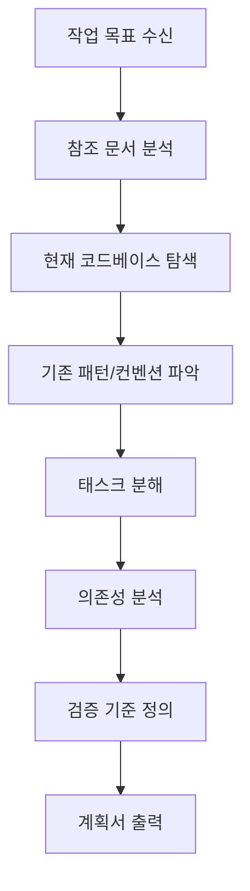

# Planner Agent 사양서

## 1. 개요

Planner Agent는 Amicus 프로젝트에서 **작업 계획 수립을 자동화**하는 서브에이전트입니다.
사용자가 "무엇을 만들고 싶다"고 말하면, 이 에이전트가 자동으로 세부 구현 계획을 수립합니다.

## 2. 역할 및 책임

### 2.1 입력
- 작업 목표 (예: "Phase 4 Interface Layer 구현")
- 참조 문서 (스펙, 아키텍처 문서 등)
- 현재 코드베이스 상태

### 2.2 출력
1. **세부 태스크 목록** (TODO 형식)
2. **의존성 그래프** (어떤 순서로 해야 하는지)
3. **검증 기준** (각 태스크 완료 조건)
4. **예상 산출물** (파일, 문서 등)

## 3. 계획 수립 프로세스



## 4. 계획서 템플릿

### 4.1 태스크 정의 형식

```markdown
### Task [번호]: [태스크명]

**목표:** [한 문장으로 명확하게]

**선행 조건:**
- [ ] [완료되어야 할 다른 태스크]

**세부 작업:**
1. [구체적인 작업 항목]
2. [구체적인 작업 항목]

**산출물:**
- `[파일 경로]` - [설명]

**검증 기준:**
- [ ] `bun run typecheck` 통과
- [ ] `bun run test` 통과
- [ ] [기능 검증 항목]

**완료 후:**
- 문서 업데이트: `[문서 경로]`
- 커밋 메시지: `feat([scope]): [메시지]`
```

### 4.2 문서화 규칙

1. **언어**: 한국어 (코드 주석, 커밋 메시지는 영어)
2. **위치**: `docs/implementation/[phase]-[feature].md`
3. **내용**:
   - 구현 배경 (왜 이렇게 했는지)
   - 주요 설계 결정
   - 사용법 예시
   - 트러블슈팅 가이드

## 5. 사용 방법

### 5.1 호출 예시

```
사용자: "Phase 4 Interface Layer를 구현하려고 해. 계획 세워줘."

Planner Agent:
1. spec/spec.md의 Phase 4 섹션 분석
2. 현재 apps/, packages/ 상태 탐색
3. 의존성 분석 (daemon → dashboard/cli)
4. 세부 계획 출력
```

### 5.2 계획 승인 흐름

```
Planner Agent → 계획서 출력 → 사용자 검토 → 승인/수정 → 구현 시작
```

## 6. 품질 기준

### 6.1 좋은 계획의 특징
- **원자적 (Atomic)**: 각 태스크는 독립적으로 완료 가능
- **측정 가능 (Measurable)**: 완료 여부를 명확히 판단 가능
- **순서 명확 (Ordered)**: 의존성에 따른 실행 순서 명시
- **검증 가능 (Verifiable)**: 자동화된 검증 기준 포함

### 6.2 필수 검증 항목
모든 태스크는 아래를 포함해야 함:
- `bun run typecheck` 통과
- `bun run test` 통과 (테스트 작성 시)
- LSP 진단 오류 없음

## 7. 연동 방식

### 7.1 OpenCode 슬래시 커맨드 (향후)

```bash
/plan "Phase 4 구현"           # 계획 수립
/plan --approve               # 현재 계획 승인
/plan --modify "Task 3 수정"  # 계획 수정
```

### 7.2 현재 사용 방식

```
사용자: "[작업 내용] 계획 세워줘"
```

에이전트가 자동으로 Planner Agent 역할을 수행하여 계획을 수립합니다.
