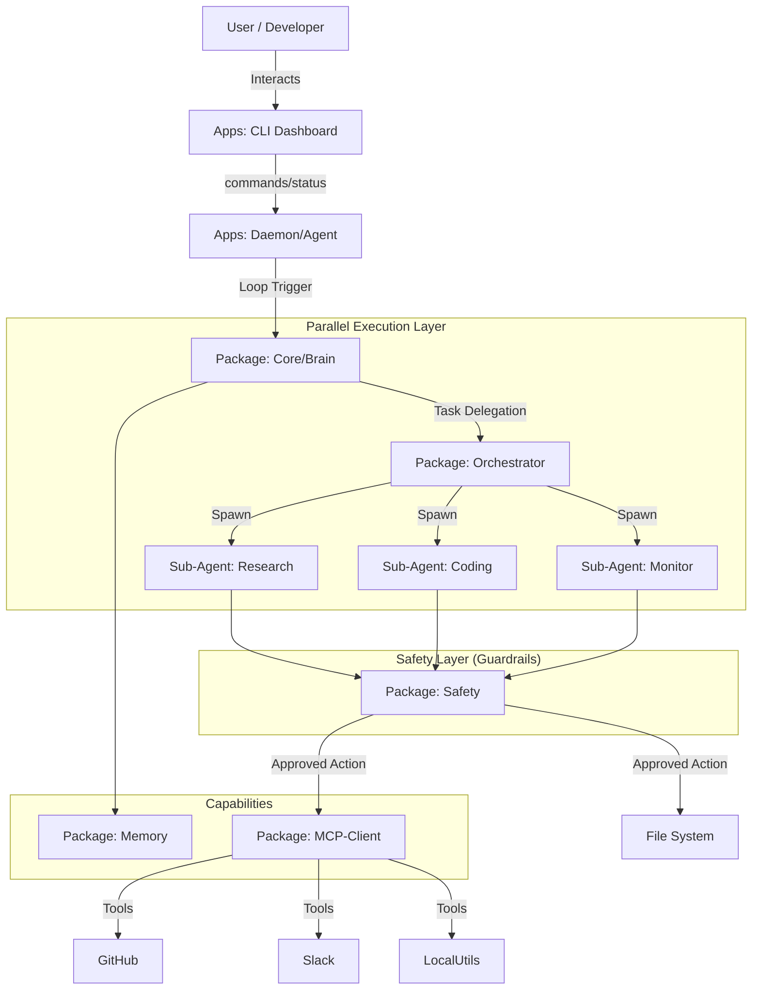

# Amicus System Architecture

## 1. 아키텍처 다이어그램 (Conceptual)

## 2. 계층별 상세 설명 (Layer Details)

### 2.1 Interface Layer (`apps/cli`)
- **역할:** 사용자와의 접점. 상태 모니터링 및 즉각적인 명령 전달.
- **기술:** React Ink, WebSocket Client.
- **주요 기능:**
  - 실시간 "생각(Thought)" 스트리밍 표시.
  - 중요 의사결정(삭제, 과금 발생 등)에 대한 사용자 승인(Human-in-the-loop) UI.
  - 현재 Routine 상태 시각화.

### 2.2 Orchestration Layer (`apps/daemon`)
- **역할:** 시스템의 심장. 멈추지 않고 루틴을 점검하고 이벤트를 처리.
- **기술:** Node.js, System Service (launchd/systemd 등).
- **주요 기능:**
  - `cron` 스타일의 정기 작업 스케줄링.
  - IDE나 OS로부터 오는 ACP 요청 수신.
  - Core 로직 구동 및 생명주기 관리.

### 2.3 Core Intelligence Layer (`packages/core`)
- **역할:** 두뇌. 무엇을 해야 할지 판단하고 계획 수립.
- **주요 컴포넌트:**
  - **Planner:** 복잡한 작업을 단계별로 분해.
  - **Economist (비용 지능):** 난이도에 따라 모델(Claude 3.5 Sonnet vs Gemini Flash 등) 선택.
  - **Thinking Process:** 연쇄적인 사고 과정 처리.

### 2.4 Safety Layer (`packages/safety`)
- **역할:** 시스템 보호. Amicus의 모든 "부수 효과(Side-effect)"는 이 계층을 통과해야 함.
- **핵심 로직 (Trust-First):**
  1. **Pre-Action:** 변경 예정인 파일들의 스냅샷 생성 (Git Stashing/Commit).
  2. **Action:** 실제 작업 수행.
  3. **Verification:** 작업 결과 검증.
  4. **Post-Action:** 실패 시 자동 롤백(`git reset`), 성공 시 `audit.log` 기록.

### 2.5 Persistence & Capability Layer (`packages/memory`, `packages/mcp-client`)
- **Memory:** `data/NOW.md` (단기), `data/MEMORY.md` (장기/의사결정)를 파싱하고 관리. 벡터 DB 대신 마크다운을 사용하여 사용자가 직접 읽고 수정 가능하게 함(Human-Readable).
- **MCP Client:** 표준 MCP 프로토콜을 구현하여 외부 툴(브라우저, 캘린더 등) 연결.

## 3. 데이터 흐름 (Data Flow)

1. **Trigger:** 시간(Cron) 또는 사용자 입력(CLI) 발생.
2. **Context Loading:** `Memory` 패키지가 현재 상황(`NOW.md`) 로드.
3. **Reasoning:** `Core`가 목표 달성을 위한 최적의 도구와 모델 결정.
4. **Safety Check:** 위험한 도구 호출(예: 파일 삭제) 시 `CLI`를 통해 사용자 승인 요청.
5. **Execution:** `Safety` 래퍼 내에서 `MCP` 또는 파일 조작 수행.
6. **Updates:** 결과에 따라 `MEMORY.md` 업데이트 및 경험 축적.
